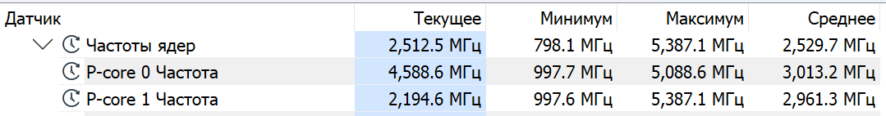
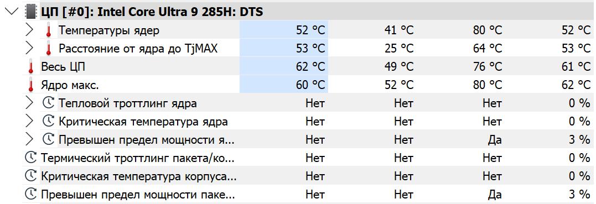
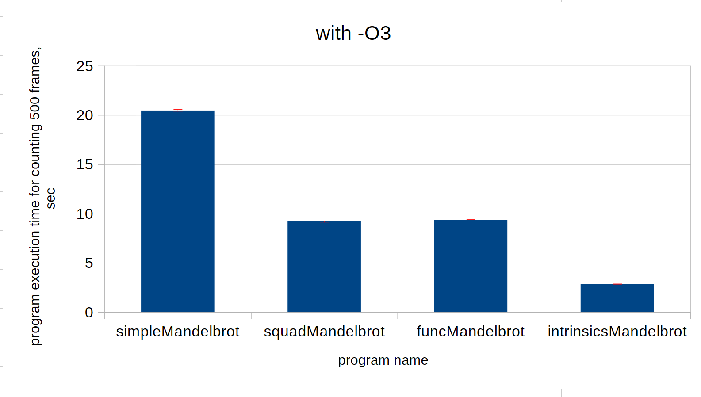
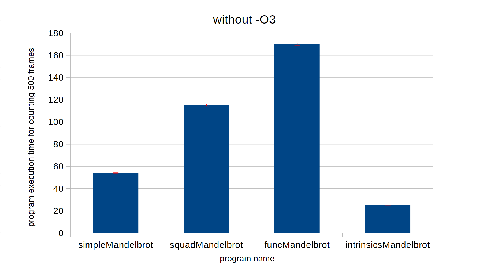

### Аппаратное обеспечение
* **Процессор:** Intel® Core™ Ultra 9 285H
* **Поддерживаемые инструкции:** SSE4.2, AVX, AVX2, FMA3.
* **Режим питания:** «Оптимальная производительность».

### Программная среда
* **ОС:** Windows 11.
* **Компилятор:** g++.exe (MinGW-W64 x86_64-ucrt-posix-seh, built by Brecht Sanders, r8) 13.2.0.
* **Инструмент замера:** `hyperfine` (усреднение по 10 прогонам, 3 прогревочных цикла, в каждом прогоне - просчет 500 кадров 800 * 600).

### Мониторинг (HWiNFO64)
В ходе тестирования проводился непрерывный мониторинг состояния системы для исключения влияния внешних факторов:
* **Частота ядер:** Частоты удерживались на стабильном уровне, что подтверждает отсутствие сброса частот.  

* **Термический троттлинг:** Согласно HWiNFO, критический перегрев зафиксирован не был, среднее значение температуры ядер поддерживалось на уровне 52°C.  

### Benchmarks of the programs compiled with -O3

| Command | Mean [s] | Min [s] | Max [s] | Relative |
|:---|---:|---:|---:|---:|
| `.\build\simpleMandelbrot.exe` | 20.459 ± 0.130 | 20.315 | 20.691 | 7.14 ± 0.07 |
| `.\build\squadMandelbrot.exe` | 9.208 ± 0.067 | 9.115 | 9.317 | 3.21 ± 0.04 |
| `.\build\funcMandelbrot.exe` | 9.348 ± 0.067 | 9.275 | 9.479 | 3.26 ± 0.04 |
| `.\build\intrinsicsMandelbrot.exe` | 2.865 ± 0.023 | 2.835 | 2.898 | 1.00 |

##### Benchmark 1: .\build\simpleMandelbrot.exe (10 runs)
  Time (mean ± σ):     20.459 s ±  0.130 s 
  [User: 18.786 s, System: 1.263 s] 
  Range (min … max):   20.315 s … 20.691 s 

##### Benchmark 2: .\build\squadMandelbrot.exe (10 runs)
  Time (mean ± σ):      9.208 s ±  0.067 s 
  [User: 8.272 s, System: 0.660 s] 
  Range (min … max):    9.115 s …  9.317 s 

##### Benchmark 3: .\build\funcMandelbrot.exe (10 runs)
  Time (mean ± σ):      9.348 s ±  0.067 s 
  [User: 8.578 s, System: 0.535 s] 
  Range (min … max):    9.275 s …  9.479 s 

##### Benchmark 4: .\build\intrinsicsMandelbrot.exe (10 runs)
  Time (mean ± σ):      2.865 s ±  0.023 s 
  [User: 2.447 s, System: 0.301 s] 
  Range (min … max):    2.835 s …  2.898 s 

#### Summary
  **.\build\intrinsicsMandelbrot.exe** ran 
        &emsp;3.21 ± 0.04 times faster than .\build\squadMandelbrot.exe 
        &emsp;3.26 ± 0.04 times faster than .\build\funcMandelbrot.exe 
        &emsp;7.14 ± 0.07 times faster than .\build\simpleMandelbrot.exe 

### Benchmarks of the programs compiled without -O3

| Command | Mean [s] | Min [s] | Max [s] | Relative |
|:---|---:|---:|---:|---:|
| `.\build\simpleMandelbrot.exe` | 53.917 ± 0.503 | 53.049 | 54.617 | 2.16 ± 0.03 |
| `.\build\squadMandelbrot.exe` | 115.274 ± 1.018 | 114.191 | 116.744 | 4.62 ± 0.06 |
| `.\build\funcMandelbrot.exe` | 170.088 ± 0.975 | 168.254 | 170.958 | 6.81 ± 0.08 |
| `.\build\intrinsicsMandelbrot.exe` | 24.968 ± 0.266 | 24.455 | 25.361 | 1.00 |

##### Benchmark 1: .\build\simpleMandelbrot.exe (10 runs)
  Time (mean ± σ):     53.917 s ±  0.503 s 
  [User: 50.226 s, System: 3.074 s] 
  Range (min … max):   53.049 s … 54.617 s 

##### Benchmark 2: .\build\squadMandelbrot.exe (10 runs)
  Time (mean ± σ):     115.274 s ±  1.018 s 
  [User: 107.804 s, System: 6.033 s] 
  Range (min … max):   114.191 s … 116.744 s 

##### Benchmark 3: .\build\funcMandelbrot.exe (10 runs)
  Time (mean ± σ):     170.088 s ±  0.975 s 
  [User: 158.415 s, System: 8.761 s] 
  Range (min … max):   168.254 s … 170.958 s 

##### Benchmark 4: .\build\intrinsicsMandelbrot.exe (10 runs)
  Time (mean ± σ):     24.968 s ±  0.266 s 
  [User: 23.058 s, System: 1.280 s] 
  Range (min … max):   24.455 s … 25.361 s 

#### Summary
  **.\build\intrinsicsMandelbrot.exe** ran 
    &emsp;2.16 ± 0.03 times faster than .\build\simpleMandelbrot.exe 
    &emsp;4.62 ± 0.06 times faster than .\build\squadMandelbrot.exe 
    &emsp;6.81 ± 0.08 times faster than .\build\funcMandelbrot.exe 

